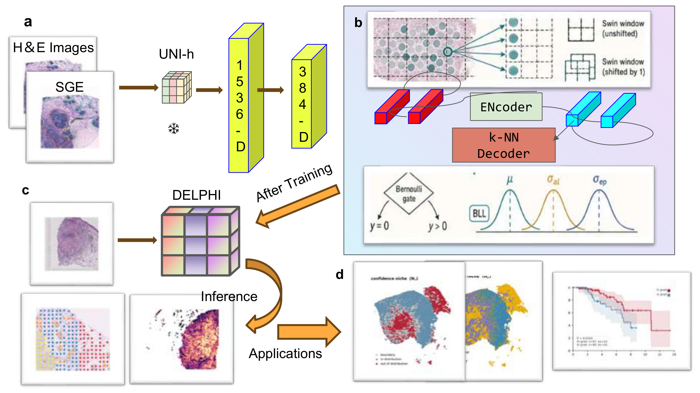

# DELPHI

**Trustworthy Spatial Molecular Profiling from Histopathology Images**

DELPHI predicts spatially resolved gene expression from routine H&E-stained
histology images with calibrated dual-scale confidence. A frozen UNI2-h vision
encoder extracts morphological features, a Swin-grid Transformer processes
spatial context, and a Bayesian last layer with a Hurdle-Gaussian head outputs
both predictions and uncertainty estimates in a single forward pass.



## Quick Start

A GPU with 24 GB VRAM is recommended.

```bash
git clone https://github.com/wakeupr41n/DELPHI.git
cd DELPHI
pip install -r requirements.txt
bash run_demo.sh
```

See [tutorial.md](tutorial.md) for a step-by-step walkthrough.

## Pre-trained Models

| Resource | Link |
|----------|------|
| Model checkpoint | [Hugging Face](https://huggingface.co/wakeupR41n/delphi) |
| Full results | [Zenodo](https://doi.org/10.5281/zenodo.20563038) |

## Datasets

| Dataset | Source |
|---------|--------|
| HER2ST | [Nature Communications](https://doi.org/10.1038/s41467-021-26271-2) |
| cSCC | [GSE144239](https://www.ncbi.nlm.nih.gov/geo/query/acc.cgi?acc=GSE144239) |
| PRAD (HEST) | [MahmoodLab/HEST](https://huggingface.co/datasets/MahmoodLab/hest) |
| TCGA-BRCA | [GDC Portal](https://portal.gdc.cancer.gov/projects/TCGA-BRCA) |
| UNI2-h | [MahmoodLab/UNI2-h](https://huggingface.co/MahmoodLab/UNI2-h) |

## License

MIT.

## Acknowledgements

DELPHI builds on [UNI2-h](https://huggingface.co/MahmoodLab/UNI2-h) (CC BY-NC 4.0)
and the [Gridded Transformer Neural Process](https://arxiv.org/abs/2410.06731).

## Citation

```bibtex
@article{delphi2025,
  title   = {DELPHI: Trustworthy Spatial Molecular Profiling from
             Histopathology Images},
  author  = {},
  journal = {Under review},
  year    = {2026},
}
```
